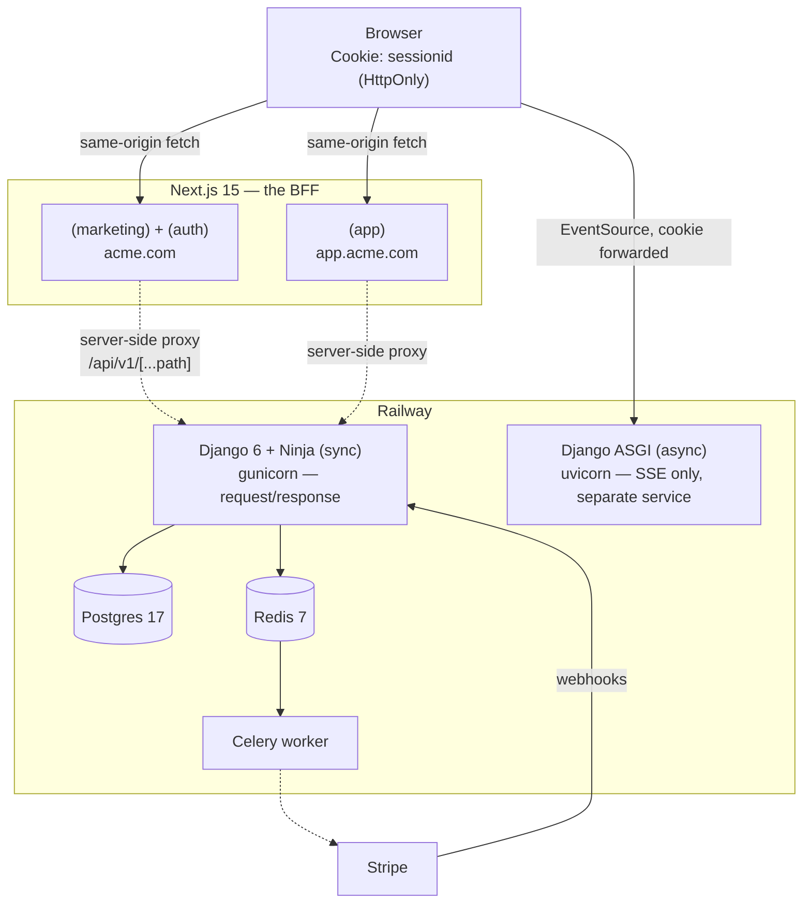
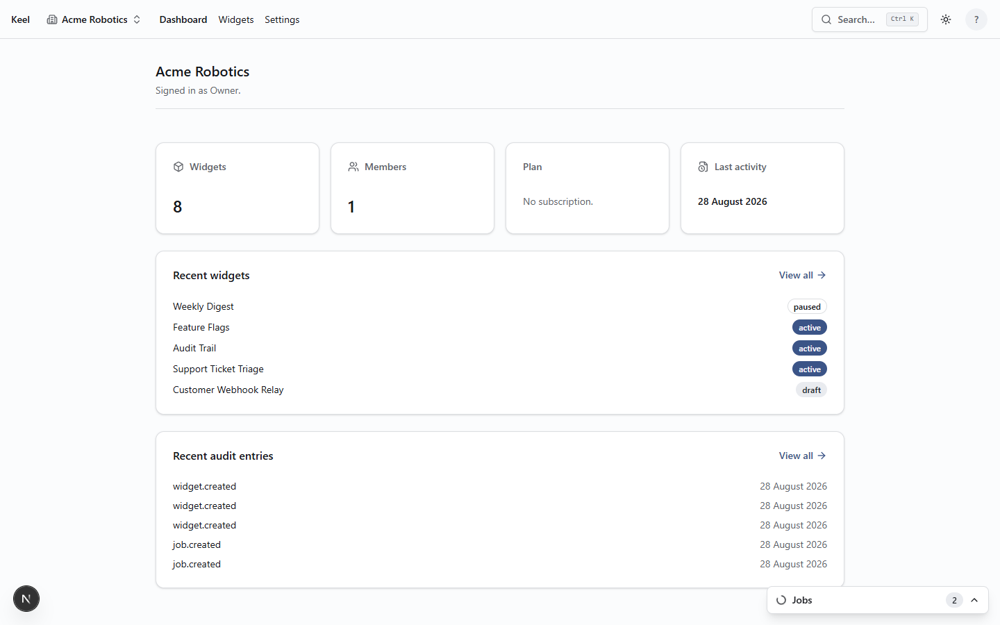
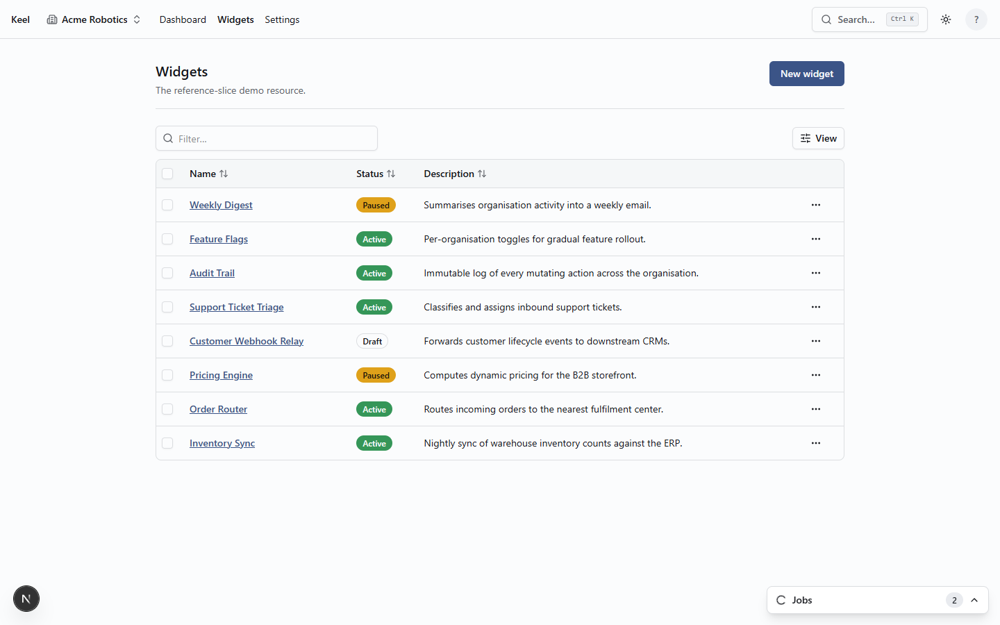
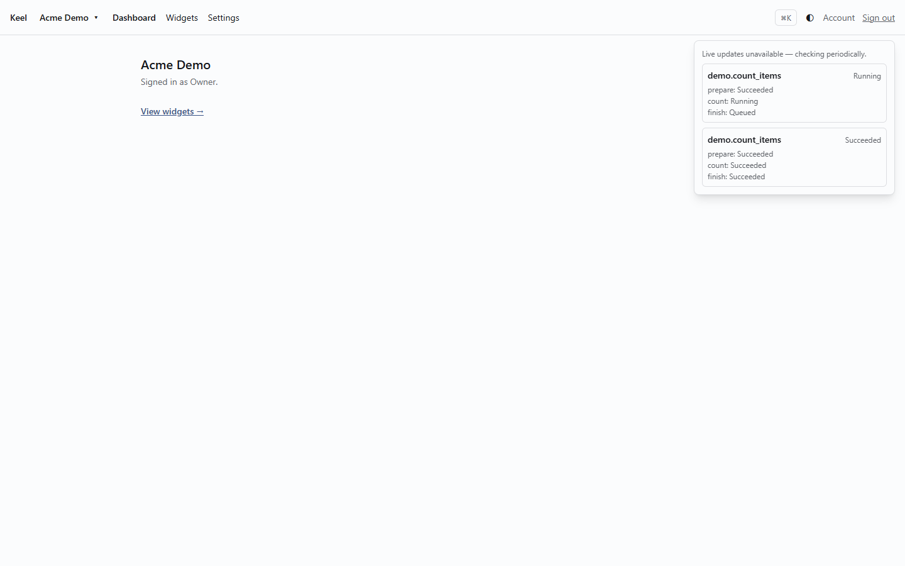
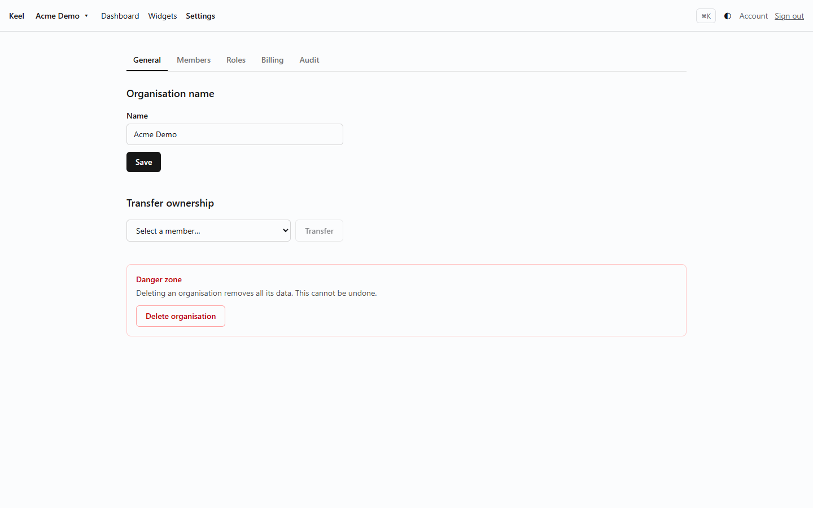

# Keel

A Django 6 + Next.js 15 SaaS template with multi-tenant organisations,
Stripe billing, background jobs, and a marketing site — built once and
instantiated per project with `scripts/init.ts`.

## Who this is for

You're starting a new multi-tenant SaaS product and don't want to
re-litigate authorization, tenant isolation, billing, and async jobs from
scratch. Keel gives you a working application with those already decided,
plus the tests and CI gates that keep the decisions from rotting as the
project grows past the person who made them.

## What you get

- **Auth** — django-allauth headless, session-cookie based, MFA-ready
- **Multi-tenant organisations** — memberships, roles, a permission
  registry, invitations
- **Stripe billing** — plans, checkout, portal, webhooks, entitlements,
  seat and credit gating, dunning
- **Background jobs** — Celery with a Tier 1 fire-and-forget shim and a
  resumable Tier 2 job runner, streamed to the browser over SSE
- **A marketing site and an application shell** — separate Next.js route
  groups on separate subdomains, sharing one session
- **A generated, typed API client** — one OpenAPI spec merged from Django
  Ninja and allauth, consumed by the frontend with nothing hand-written
- **`scripts/init.ts`** — renames the project, strips the parts you don't
  want (marketing site, demo resource, a billing shape), and resets git
  history for a clean instantiation

## What this is not

A practical SaaS boilerplate, not an AI starter kit, not a framework, and
not a hosted product. There is no dashboard you log into, no managed
service behind it, and no plugin system — it is a repository you fork and
then own. If you want something you configure instead of read, this isn't
it.

## The invariants

Most boilerplates are a pile of features. This one is a pile of features
plus a build that fails when you break the tenant boundary. Seven rules
hold the codebase together, and four of them are enforced by CI rather
than by convention — `docs/architecture.md` and `keel-prd.md` §4 have the
full detail, this is the short version:

| Invariant                                                                                                                                         | Enforced by                                                                                                                         |
| ------------------------------------------------------------------------------------------------------------------------------------------------- | ----------------------------------------------------------------------------------------------------------------------------------- |
| Domain logic lives only in `services.py` (writes) / `selectors.py` (reads)                                                                        | Code review; `keel/domain/`, if used, is walled off by an `import-linter` contract                                                  |
| Authorization is expressed only in `organizations/permissions.py`, as `Decision`, never a bare bool                                               | `scripts/check_permission_lint.py`; a CI meta-test requires an allow **and** a deny test, asserted on the _reason_, for every guard |
| One `transaction.atomic()` per service, opened in the service; Stripe calls happen on `transaction.on_commit()`                                   | Code review                                                                                                                         |
| Schema changes are Django migrations only                                                                                                         | `manage.py makemigrations --check --dry-run` in CI                                                                                  |
| Async work is Tier 1 (`keel/core/tasks.py` shim, fire-and-forget) or Tier 2 (`keel/jobs/`, resumable) — never blurred                             | Code review                                                                                                                         |
| Every viewset declares `organization_scoped = True` + a `test_factory`, or `= False` + a `GLOBAL_JUSTIFICATION`; cross-org access is 404, not 403 | `__init_subclass__` fails at import without one; `test_meta_router_wiring.py` and `tenant_isolation.py` walk every route            |
| Every mutating service is `@audited(...)` or `@not_audited(reason=...)`, and coverage is gated per directory                                      | An audit meta-test; `scripts/check_coverage.py` reads per-path floors from `pyproject.toml`                                         |

Run `/check-invariants` (a Claude Code slash command shipped in this repo)
to execute every one of these gates locally before opening a PR.

## Architecture



Every `/api/v1/…` and `/_allauth/…` call is same-origin against Next.js,
which forwards it to Django server-side — the browser never talks to the
API host directly (`docs/adr/0002-auth-bff-shape.md`). The full request
path, the type-synchronisation pipeline, and the deployed-system diagram
live in `docs/architecture.md` and `docs/diagrams/system.md`.

## Screenshots

|                                                      |                                                      |
| ---------------------------------------------------- | ---------------------------------------------------- |
|  |  |
| Application shell                                    | A resource list (organisation-scoped, paginated)     |
|          |            |
| The job tray, streamed over SSE                      | Organisation settings                                |

## Quick start

Prerequisites: Docker, Node 22+, pnpm 9+, Python 3.12+, and [`uv`](https://docs.astral.sh/uv/).

```bash
pnpm install
cp .env.example .env
grep '^NEXT_PUBLIC' .env.example > apps/web/.env.local

docker compose -f infra/compose.dev.yml up -d      # Postgres 17, Redis 7, Mailpit, MinIO
pnpm --filter @keel/emails build                   # required before the API tests run
cd apps/api && uv run python manage.py migrate && cd ../..

pnpm dev
```

`pnpm dev` starts Django and Next, not Celery — signup emails, webhooks,
and background jobs need a worker too, in a separate terminal:

```bash
cd apps/api && uv run celery -A config worker -Q default,email,external,scheduled -l info
```

|                  |                               |
| ---------------- | ----------------------------- |
| Marketing + auth | http://lvh.me:3000            |
| Application      | http://app.lvh.me:3000        |
| API              | http://api.lvh.me:8000        |
| Django admin     | http://api.lvh.me:8000/admin/ |
| Mailpit          | http://localhost:8025         |

Create an admin user with `cd apps/api && uv run python manage.py createsuperuser`.

`lvh.me` is a public DNS name whose wildcard resolves to `127.0.0.1` — it
needs no setup, but does need network access; `docs/dev-setup.md` has a
hosts-file fallback and the reason `localhost` doesn't work for a
cross-subdomain session cookie.

### Making it your project

```bash
node scripts/init.ts
```

Renames the project and the tenant noun everywhere (content, files,
directories), applies your choices — keep or drop the marketing site,
the demo resource, a billing shape, an optional pure `domain/` layer —
regenerates lockfiles and the API client, resets git history, and deletes
itself. Run it once, interactively or with flags (`node scripts/init.ts
--help`), before you start building. After that, `docs/brand-pass.md`
(which it generates) is the first checklist.

## Commands

```bash
pnpm dev            # Django + Next, both hot-reloading
pnpm lint           # ruff + eslint + prettier
pnpm typecheck      # mypy + tsc
pnpm test           # pytest (with the coverage gate) + vitest

cd apps/api
uv run pytest                       # needs the email templates built first
uv run lint-imports                 # the keel/domain and keel/core contracts
uv run python manage.py makemigrations --check --dry-run
```

`pnpm --filter @keel/emails build` before running the API suite — a root
`conftest.py` will remind you if you forget.

`docs/pre-push.md` sets up a local `git push` hook that mirrors CI's
blocking gates, so a broken push fails on your machine instead of burning
Actions minutes.

## Layout

```
apps/
  api/          Django 6 + Ninja. Domain logic in services.py, reads in selectors.py
  web/          Next.js 15, App Router. (marketing) (auth) (app) route groups, plus the BFF proxy
packages/
  api-client/   Generated from OpenAPI — src/generated is never hand-edited
  emails/       react-email templates, rendered to HTML at build
  ui/           theme.css token contract + shared components
infra/          compose files, Caddyfile, railway.json, k6 smoke test
docs/           architecture.md, auth-flow.md, diagrams/, deployment, dev setup
scripts/        init.ts, coverage gate, permission lint, OpenAPI merge
```

Every Django app under `apps/api/keel/` shares the same seven-file shape:
`models.py` `services.py` `selectors.py` `permissions.py` `serializers.py`
`views.py` `tasks.py` plus `tests/`. `pnpm gen resource` (or
`pnpm gen readonly-resource`) generates a new one following that shape,
reading from `templates/` — `.claude/commands/new-resource.md` is a thin
wrapper that runs the generator and then does the judgement work it
deliberately leaves undone. `apps/api/keel/widgets/` is a committed render
of `templates/resource`, kept honest by CI rather than hand-maintained;
see CLAUDE.md's generator catalogue for the full command list.

## Documentation

- `docs/architecture.md` — the seven invariants in full, the request
  path, the type-synchronisation pipeline
- `docs/auth-flow.md` — signup, login, session refresh, cross-host cookie
  behaviour
- `docs/billing.md` — plans, entitlements, webhooks, the credit ledger
- `docs/jobs-and-audit.md` — Tier 1/Tier 2 async work, the audit trail
- `docs/storage.md` — presigned uploads
- `docs/query-patterns.md` — fixed-query-count endpoints and how to test one
- `docs/deploy-railway.md` — the Railway deployment path
- `docs/dev-setup.md` — local subdomain routing in detail
- `docs/maintenance.md` — day-two operational tasks

## Roadmap

Deliberately absent, not forgotten:

- **A pure `domain/` layer** for scoring/pricing/ledger logic with no
  Django import — the seam exists (`keel/domain/`, `import-linter`) but
  no project instantiated from this template has needed it yet.
- **Stripe test-clock coverage** (trial end, renewal, cancellation) —
  needs a live Stripe test account; everything else runs against
  `stripe-mock`.
- **Wider third-party connections** beyond the one OAuth pattern
  `keel/connections/` demonstrates.

Brein AI is the first product built on Keel, not part of it — its build
surfaced some of the fixes in later phases, but it ships its own features
on its own schedule, outside this repository.

## Deployment

`docs/deploy-railway.md` covers the Railway path, including whether the
target Postgres ships `pgvector` (it does not by default) and which
templates do. The SSE endpoint runs as a **separate uvicorn service** from
the same image — a held-open connection under a sync worker pool exhausts
it far below what request/response load testing suggests, and a proxy
that buffers `text/event-stream` produces a job tray that shows nothing
for minutes and then everything at once. `infra/railway.json` declares
both services.

## Licence

MIT — see [LICENSE](LICENSE).
