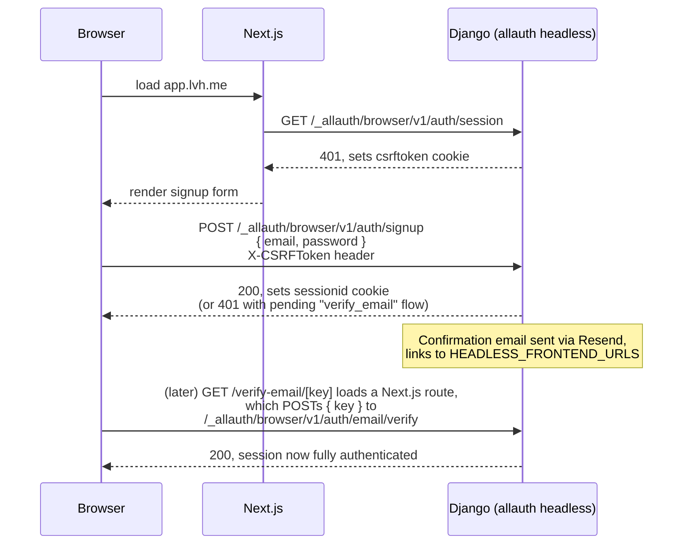
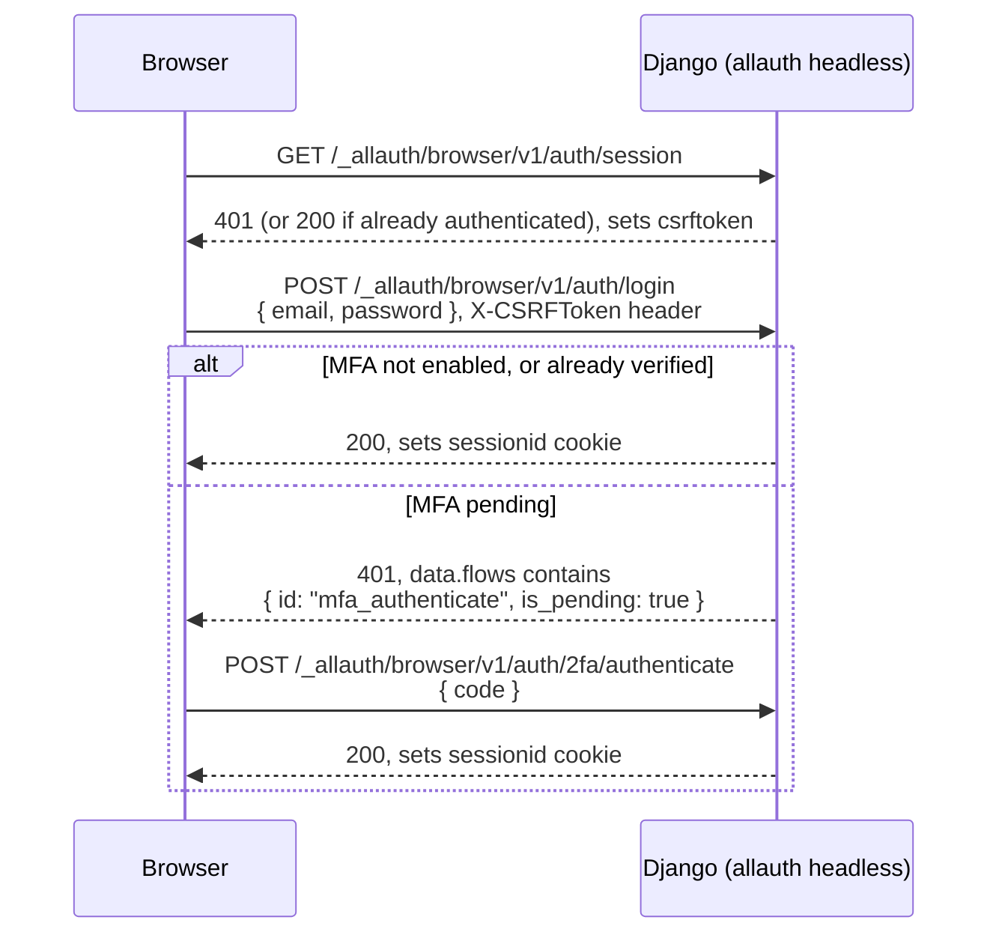
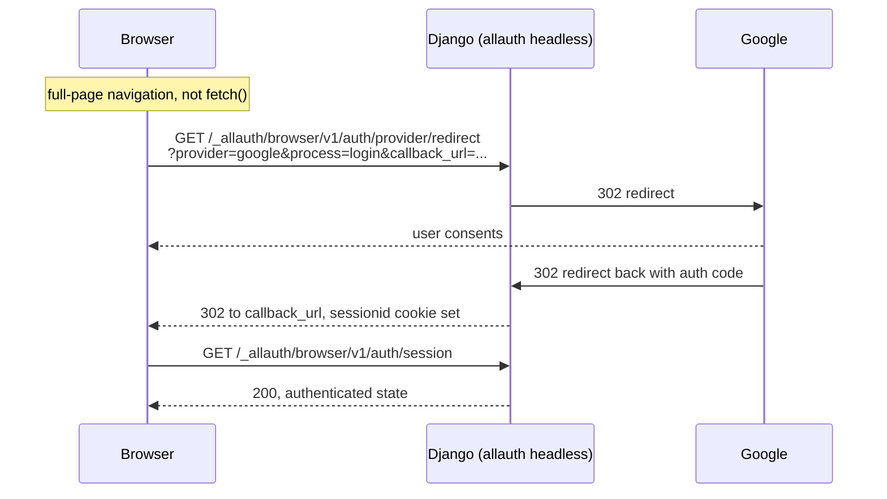
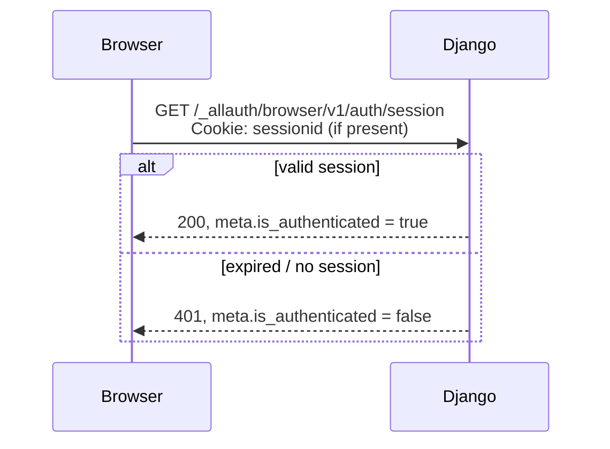
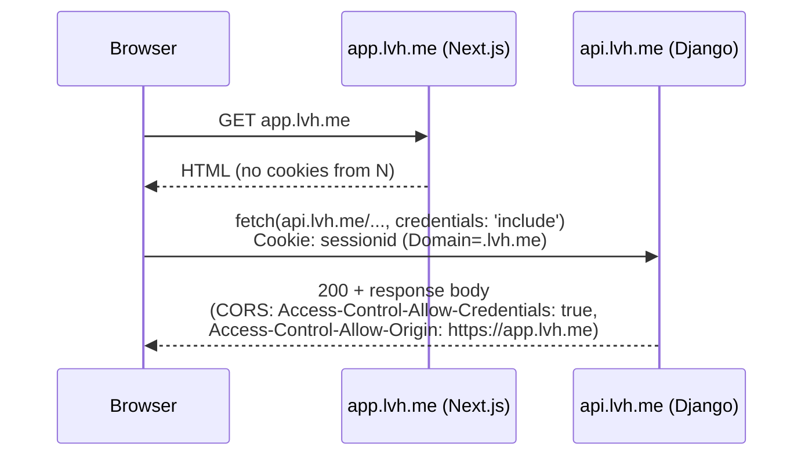
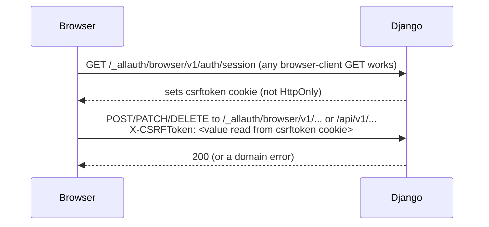

# Auth flow

The request-level picture behind `docs/auth-client-contract.md`, which has
the wire-level mechanics (exact headers, cookie attributes, endpoint
list). This document is the diagram; that document is the reference.

All identity endpoints are under `/_allauth/browser/v1/…` (the allauth
**browser** client — cookie-based, CSRF-protected). Django is the sole
session authority: there is no token stored in `localStorage` or
`sessionStorage` anywhere in `apps/web`.

---

## Signup

Confirm-password is a client-side UX concern only — allauth's wire shape
takes one `password` field, never two.

## Login

The client distinguishes "no session" from "awaiting TOTP" by inspecting
`data.flows` on the 401 body, not by status code — `meta.is_authenticated`
is `false` in both cases.

## Google OAuth (social login)

## Session refresh / page load

Every app-shell page load calls this once to resolve auth state — there is
no client-side session cache that outlives the cookie itself.

## Cross-host cookie behaviour

`sessionid` and `csrftoken` are both `Domain`-scoped to the registrable
parent domain (`.acme.com` in production, `.lvh.me` in dev; host-only,
i.e. unset `Domain`, on plain `localhost`, which is why the project uses
`lvh.me` instead — see `README.md` "Why `lvh.me` and not `localhost`").
This is what lets one session cookie authenticate both the marketing/app
Next.js host and the separate API host. There is currently no BFF
proxying this call from within Next.js — the browser calls the API origin
directly; see `docs/architecture.md`'s "Note on the pipeline today" for
the gap this leaves for Phase 11.

## CSRF acquisition

Django's CSRF middleware only sets the `csrftoken` cookie on a response
that calls `get_token()`, and every allauth headless **browser**-client
view does so:

`GET` requests never need the header. The same `csrftoken` cookie and
header cover both `/_allauth/browser/v1/…` and `/api/v1/…` — Django's
default CSRF cookie/header names, unchanged.

## 401 vs 403

Both API surfaces distinguish "not authenticated" from "authenticated but
disallowed," but the two do not share a response envelope — see
`docs/auth-client-contract.md` "Response envelope" for the two shapes.

| Status | `/_allauth/browser/v1/…` meaning | `/api/v1/…` meaning |
|---|---|---|
| **401** | No session, or a partially-authenticated session (e.g. TOTP pending — check `data.flows`, not the status code alone) | No session, or an expired one |
| **403** | Action disallowed for a reason that isn't "log in" (signup closed, social re-auth required) | Authenticated but denied by `has_perm` — `code` in the error envelope is `Decision.reason` (`docs/architecture.md` invariant 2) |
| **409** | Conflict with current state (already authenticated, email link reused) — not guaranteed to carry an `errors` array | Conflict from a `DomainError` subclass mapped to 409 |

The rule that matters for `/api/v1/…`: **403 always carries a machine
readable `reason`**, because `has_perm` returns a `Decision`, never a
bare bool. A 403 with no `code` in its `error` body means something raised
`PermissionDenied` directly instead of going through `has_perm` — that is
a bug against invariant 2, not an expected shape.

---

## See also

- `docs/auth-client-contract.md` — cookies, headers, exact endpoint list,
  response envelopes, MFA flag behaviour.
- `docs/architecture.md` — invariant 2 (authorization), the request path,
  and the BFF gap this document's cross-host diagram points at.
