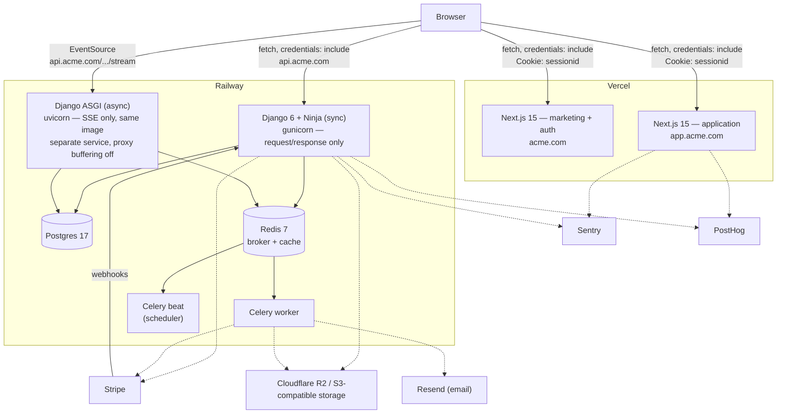

# System diagram

The deployed shape, redrawn as
Mermaid so it renders on GitHub. See `docs/architecture.md` for the
request-level walk-through and `docs/auth-flow.md` for the auth sequences.

## Why the SSE service is separate

`api.acme.com/…/stream` is served by a **second Railway service running
the same image**, under uvicorn instead of gunicorn. A held-open SSE
connection under the sync worker pool exhausts it at a concurrent-user
count far below what ordinary request/response load testing suggests, and
the proxy configuration that turns off buffering for `text/event-stream`
should not be applied to the API's ordinary traffic. `infra/railway.json`
declares both services from one image; see `docs/deploy-railway.md` for
the Railway-specific configuration.

## Two Next.js hosts, one session

`acme.com` (marketing + auth) and `app.acme.com` (application) are two
Next.js deployments sharing one `sessionid` cookie, `Domain`-scoped to the
registrable parent domain. `docs/auth-flow.md`'s "Cross-host cookie
behaviour" diagram covers the request shape this enables; `README.md`'s
"Why `lvh.me` and not `localhost`" covers why local dev needs a real
registrable domain to reproduce it.
